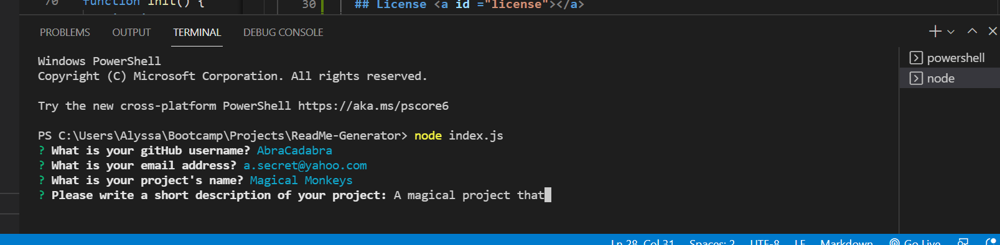
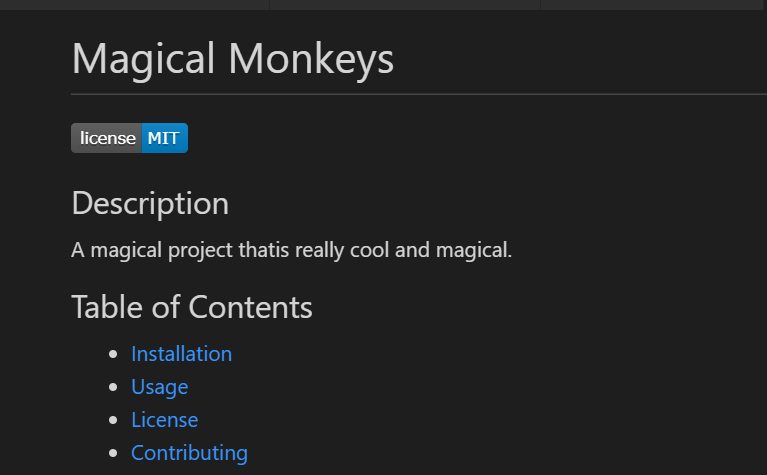

  # README generator

  

  ## Description 
  This program allows a user to answer a few short prompts to generate a professional README.md file. This file will include a title, license, and description, as well as directions for installation, usage, contribution, and testing. The file will also contain a dynamic table of contents and links to contact the developer.

  ## Table of Contents

  * [Installation](#installation)
  * [Usage](#usage)
  * [License](#license)
  * [Questions](#questions)

  ## Installation <a id="installation"></a>

  To install necessary dependencies, run the following command: 

  ```
  npm i
  ```

  ## Usage <a id="usage"></a>
  To view a demo of this program in use, click [here](https://watch.screencastify.com/v/6sW23UaKGt9qhkNt2f5A)

  After initializing the application by using the command ```node index.js```, the user will be prompted to answer questions about their repository in the terminal. This can be seen in the image below.
  

  When the user is done answering prompts, a README.md file will automatically be generated in the 'output' folder. This file will have properly styled headings, a title, and if the user chose one, a license. A snapshot of a sample output file can be seen below.
  

  ## License <a id ="license"></a> 
  This project is licensed under the MIT license.

  ## Questions? <a id="questions"></a>
  If you have any questions about the repo, open an issue or contact me directly at
   [alyssa.ferry96@gmail.com](alyssa.ferry96@gmail.com).

   You can view more of my work on my GitHub profile here: [AlFerry](https://github.com/AlFerry/).

